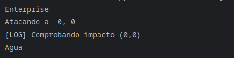
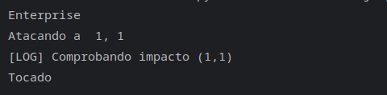
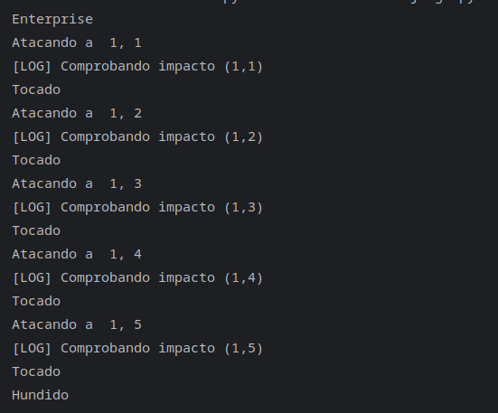

Ejemplo de agua, es decir que en esa casilla no hay nada.
  
Un ejemplo en el que solo se toca una casilla de una nave para que unicamente printee tocado.   
  
Un ejemplo de que un barco se hunde del todo.  
  